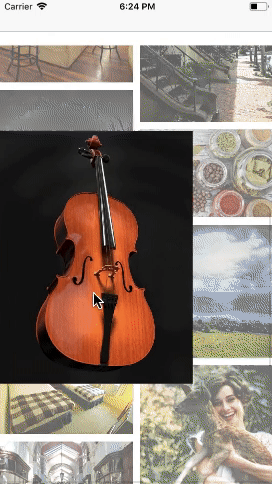

#  THStorytellingView

[](https://travis-ci.org/TileImageTeamiOS/THStorytellingView)

[](https://github.com/younatics/YNDropDownMenu/blob/master/LICENSE)
[](https://developer.apple.com/swift/)
<a href="https://developer.apple.com/xcode">
  
</a>

This is the sample application for [THTiledImageView](https://github.com/TileImageTeamiOS/THTiledImageView.git), [THContentMarkerView](https://github.com/TileImageTeamiOS/THContentMarkerView),
 [THScrollView-minimap](https://github.com/TileImageTeamiOS/THScrollView-minimap.git) modules. You can see the feature of those libraries in this sample app.


## Feature
- [x] High Quality images(8K, 12K or more) are downloaded and rendered asynchronously using [THTiledImageView](https://github.com/TileImageTeamiOS/THTiledImageView.git).
- [x] Every markers in UIScrollView added using [THContentMarkerView](https://github.com/TileImageTeamiOS/THContentMarkerView). You can add markers on UIScrollView with contents by using THContentMarkerView.
- [x] We set various examples of marker contents. Don't hesitate to see it. 🧐
- [x] [THScrollView-minimap](https://github.com/TileImageTeamiOS/THScrollView-minimap.git) let you know where you zoom in, when you zoom deep inside of UIScrollView.
- [x] In this app, we use [Firebase](https://firebase.google.com) for backend support.
- [x] Pure Swift 4.0

## Demo

| High Quality Images |Tile Image View|
|--------|--------|
| | |

| Stroy Telling View|Explain View|
|--------|--------|
| | |

## Installation

### CocoaPods

You can install the latest release version of CocoaPods with the following command

```bash
$ gem install cocoapods
```

We already set `Podfile` for this app. So, just run the following command:

```bash
$ pod setup
$ pod install
```

### Server


To receive a tile, you must place it on your local or server. The tiles in the demo are available at [https://github.com/grohong/flask](https://github.com/grohong/flask).

```bash
$ git clone git@github.com:grohong/flask.git
```

Servers created based on flask will work by using the corresponding command in that directory.

```bash
$ python image_render.py
```

### Marker Info

Marker information is currently managed using firebase. Please contact [hjw01234@gmail.com](mailto:hjw01234@gmail.com) to use marker information.

## Requirements

`THStorytellingView` is written in Swift 4, and compatible with iOS 9.0+

## Contributing

Please look over these things first.
- Please read our [Code of Conduct](https://github.com/TileImageTeamiOS/THStorytellingView/blob/master/Code_of_Conduct.md)
- Download the project and check out the current code base. Suggest any improvements by opening a new issue.
- Please install [SwiftLint](https://github.com/realm/SwiftLint) to keep our conventions.

## License

`THStorytellingView` is released under the MIT license. [See LICENSE](https://github.com/TileImageTeamiOS/THStorytellingView/blob/master/LICENSE) for details.
